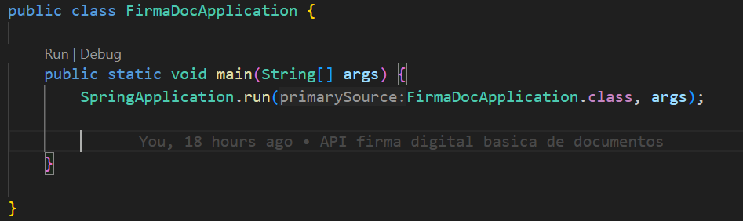
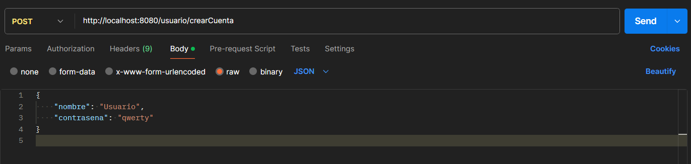
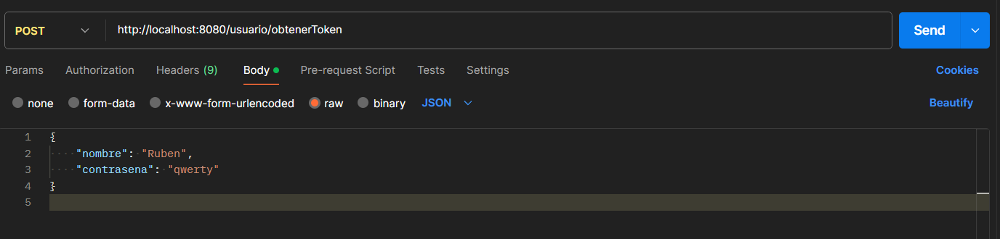
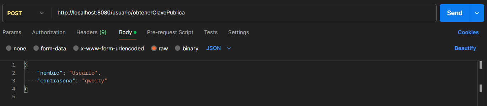
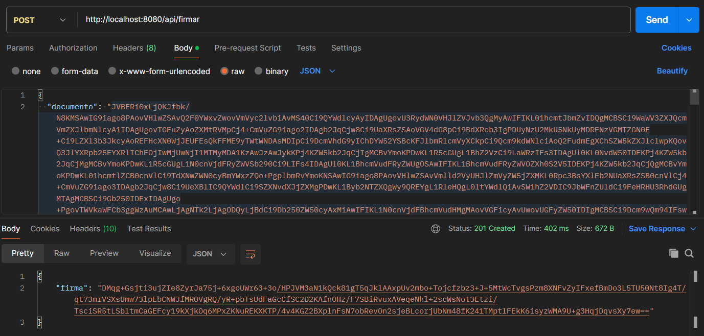
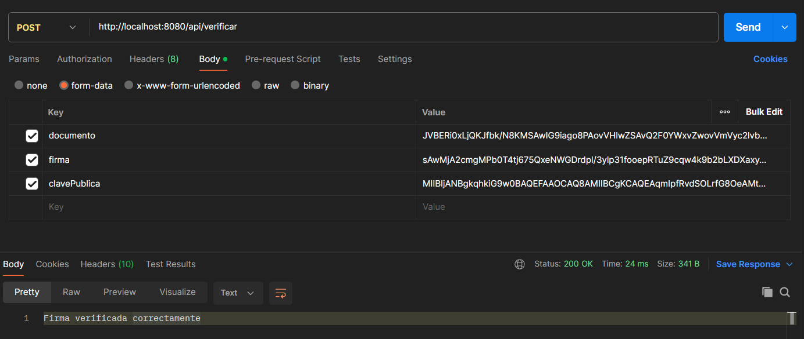

# APIFirmaDocumentos

# Manual de usuario

### Este README  detalla paso a paso cómo preparar el entorno,decargar el proyecto, compilar y ejecutar la aplicación y el proceso de firma de un documento mediante la aplicación de Postman.

1. Requisitos previos
- Java 17
- Maven 3.9
- Navegador web moderno, como Chrome,Mozilla o Brave.

2. Descarga e instalación de JDK (Java)
1. Accede a https://www.oracle.com/java/technologies/javase/jdk17-archive-downloads.html
2. Descarga la versión Java SE 17 o superior para tu sistema operativo.
3. Ejecuta el instalador y sigue las indicaciones por defecto.
4. Accede a Editar las variables de entorno del sistema -> Variables de entorno -> Variables del sistema -> Nueva -> En el nombre de la variable indicar: JAVA_HOME, y el valor de la variable: la ruta en la que el que has instalado el JDK previamente, Ejemplo: C:\Program\Java\jdk-17.0.9
5. (Para Windows o macOS) Buscar en la misma lista (Variables del sistema) la variable Path, presionar el botón de editar y añadir %JAVA_HOME%\bin
y aceptar.

6. Verifica la instalación abriendo una terminal o consola y ejecutando: java -version
Deberías de ver algo como: java version "17.X.X".

3. Descarga e instalación de Maven

1. Accede a https://maven.apache.org/download.cgi
2. Descarga la versión para tu sistema operativo, en formato .zip o tar.gz.
3. Descomprime el .zip o tar.gz en la carpeta en la que quieras realizar la instalación.
Ej: C:\maven
4. Al igual que en el proceso de configuración del JDK, accede a edición de variables del entorno y crea una variable nueva llamada MAVEN_HOME con el valor de la ruta de la carpeta en la que realizaste la instalación. teniendo en cuenta que debes incluir la carpeta bin.
Ej: C\maven\ ... \bin

5. Editar la variable Path y añadir: %MAVEN_HOME%\bin
6. Verifica la instalación abriendo una terminal o consola y ejecutando:mvn -v
Deberías de ver algo como: Apache Maven X.X.X

4. Descargar un IDE
- IntelliJ IDEA Community: https://www.jetbrains.com/idea/download/

- Eclipse IDE: https://www.eclipse.org/downloads/

- Visual Studio Code + extensiones Java: https://code.visualstudio.com/

- Se recomienda Visual Studio Code, porque incluye un cliente de Git integrado y facilita el proceso de clonación del repositorio.
- En el caso de elegir otro IDE, habría que realizar el proceso de descarga e instalación de Git.
1. Windows: Descarga e instala Git for Windows desde https://git-scm.com/download/win

macOS:

Con Homebrew: brew install git

O desde el instalador en https://git-scm.com/download/mac

Linux (Debian/Ubuntu):
sudo apt update
sudo apt install git

Luego, comprueba la instalación ejecutando en terminal: git --version

2. Configurar Git 
- Ejemplo: 2. IntelliJ IDEA

1. Abre IntelliJ IDEA y ve a File > Settings (Windows/Linux) o IntelliJ IDEA > Preferences (macOS).

2. En el panel, selecciona Version Control > Git.

3. En “Path to Git executable”, indica la ruta de git en tu sistema (por ejemplo, C:\Program Files\Git\bin\git.exe).

4. Haz clic en Test para verificar que IntelliJ detecta correctamente Git.

5. Clonar el repositorio.
1. Abre tu terminal o la terminal integrada del IDE.
```markdown
git clone https://github.com/RubenMC96/APIFirmaDocumentos.git
cd APIFirmaDocumentos
```
2. Compilar la aplicación
```
mvn clean install
```
3. Ejecutar la aplicación
- Acceder al archivo: APIFirmaDocumentos-> src-> main-> java\ com \ firmaDoc -> FirmaDocApplication.java.
Hacer click en **Run** 

4. La ruta de acceso al servidor es:
```
http://localhost:8080
```
- La aplicación al ser una API, no dispone de parte visual para el cliente, por lo que si se accede directamente se encontrará un login en el cual no podrá acceder.
- La ruta del servidor se usará para acceder al gestor de base de datos.
```
http://localhost:8080/h2-console
```
- La documentación de los requisitos y detalles de la api se pueden consultar en:
```
http://localhost:8080/swagger-ui/index.html
```


6. Funcionamiento de la aplicación:

1. Creación de un usuario:
- ## POST /usuario/crearCuenta -> Devuelve el nombre del usuario creado.
- 

2. Obtención del token:
- ## POST /usuario/generarToken -> Devuelve el token generado, válido por 24 horas
- 

3. Obtención de la clave pública:

- ## POST /usuario/obtenerClavePublica -> Devuelve la clave pública del usuario, válida para la verificación del documento.
- 

4. Firma del documento
- ## POST /api/firmar (El documento debe de proporcionarse en Base64).
- -> Devuelve la firma del documento
- 

5. Verificación de la firma
- ## POST /api/verificar -> Indica si la verificación ha sido exitosa o no.
- 


